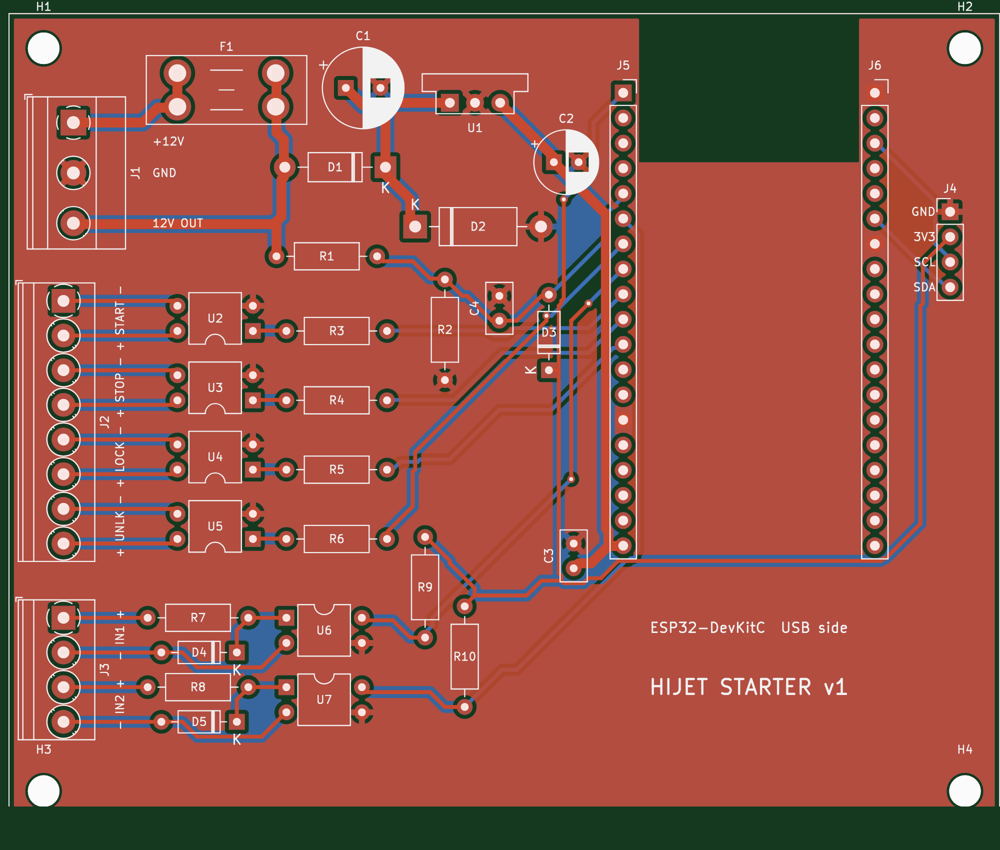

# 基板（ESP32-DevKitC キャリア）

秋月 **ESP32-DevKitC-32E** を挿して使う、リード部品だけの 2 層基板です。



| 項目 | 内容 |
|---|---|
| 外形 | 100 × 82 mm、角に M3 取付穴 ×4 |
| 層 | 2 層（両面に GND ベタ） |
| 最小パターン幅 / 間隔 | 0.4 mm / 0.3 mm（電源系は 1.0 mm） |
| 最小穴径 | 0.4 mm（ビア） |
| DRC | 違反 0・未接続 0（`drc_report.txt`。`lib_footprint_issues` は環境の通知のみ） |

## 発注するファイル

- **`hijet_starter_gerber.zip`** … ガーバー＋ドリル一式。DigiKey など、基板製造サービスにそのままアップロードします。
- 発注時の設定：2 層、FR-4、板厚 1.6 mm、銅厚 1 oz、表面処理は HASL（鉛フリー）、レジストは緑、シルクは白。

> **発注前に必ず確認してください。** `hijet_starter_1to1.pdf` を**原寸（100%・拡大縮小なし）**で印刷し、
> 実物の DevKitC のピンが J5・J6 の穴の位置に合うことを確かめてください。
> 列の間隔 25.4 mm は Espressif の公開資料に基づく値ですが、実物での確認はまだしていません。

## 回路

| ブロック | 内容 |
|---|---|
| 電源 | J1「+12V」→ F1 ミニ平型ヒューズ 1A → D1 1N5819（逆接保護）→ D2 P6KE22A（サージ吸収）・C1 100µF → U1 OKI-78SR（5V）→ C2 100µF・C3 0.1µF → ESP32 の 5V ピン |
| 電圧測定 | ヒューズの後ろの 12V → R1 100k / R2 22k で分圧 → GPIO34。C4 0.1µF でノイズ除去、D3 BAT85 で 3.3V を超えないようクランプ |
| リモコン出力 ×4 | GPIO25 / 26 / 27 / 32 → 470Ω → PC817C（U2〜U5）の LED。トランジスタ側を J2 に出す（ESP32 とは電気的に絶縁） |
| 予備入力 ×2 | J3 の IN+ → 2.2k → PC817C（U6・U7）→ IN−。1N4148 で逆電圧を保護。出力は GPIO33 / GPIO35（10k で 3.3V にプルアップ、信号ありで LOW） |
| I2C | J4：GND / 3V3 / SCL(GPIO22) / SDA(GPIO21)。0.96 インチ OLED（SSD1306）モジュールと同じピンの並び |

## 端子の使い方

| 端子 | ピン | つなぐ先 |
|---|---|---|
| J1 | +12V | ヒューズ電源（常時電源）。車両側にもヒューズを入れる |
|  | GND | ボディアース |
|  | 12V OUT | ヒューズ通過後の 12V（予備入力の IN+ 用） |
| J2 | START + / − | リモコンの始動ボタンの両端。**＋側をボタンの電圧が高い側**につなぐ |
|  | STOP / LOCK / UNLK | 同様に停止・施錠・解錠ボタン |
| J3 | IN1 + / − | 例：ドアの開閉信号（スイッチが GND に落ちるタイプ）は、IN+ を「12V OUT」へ、IN− をドアの信号線へつなぐ |
| J4 | GND 3V3 SCL SDA | OLED や温度センサー（BME280 など） |

## 組み立て

部品表は `bom.csv` です。部品番号は基板のシルク印刷と同じです。

1. 背の低い部品から順にはんだ付けします：抵抗 → ダイオード → フォトカプラ → セラミックコンデンサ → ピンソケット → 電解コンデンサ → 端子台 → ヒューズホルダー → DC-DC。
2. **向きのある部品に注意してください。**
   - ダイオード（D1〜D5）：本体の帯（カソード）を、シルクの縦線と「K」の側に合わせる。
   - 電解コンデンサ（C1・C2）：長い足（＋）を、シルクの「+」がある四角いパッドに。
   - フォトカプラ（U2〜U7）：本体の 1 番ピンの丸印を、四角いパッドに合わせる。
   - OKI-78SR（U1）：1 番ピン（Vin）を四角いパッドに。
3. **ESP32 を挿す前に**、J1 に 12V をつないで、J5 の 19 番ピン（いちばん下）と GND の間が約 5V になることをテスターで確認します。
4. DevKitC は **USB コネクタが基板の下側（「USB side」の文字の方）**に来る向きで挿します。
5. ESP32 に USB で書き込むときは、J1 の 12V を外してください（両方から同時に給電しないため）。

## 作り直すとき

```
./build.sh   # 生成 → DRC → ガーバー/ドリル → zip → BOM → 原寸 PDF → プレビュー画像
```

KiCad 7（`kicad-cli` と Python の `pcbnew`）と numpy が必要です。部品の位置と接続先は `gen_pcb.py` の上の方にまとめてあります。
配線は簡易オートルーターで引いているので、部品を動かしたら必ず `./build.sh` で DRC を通してください。
